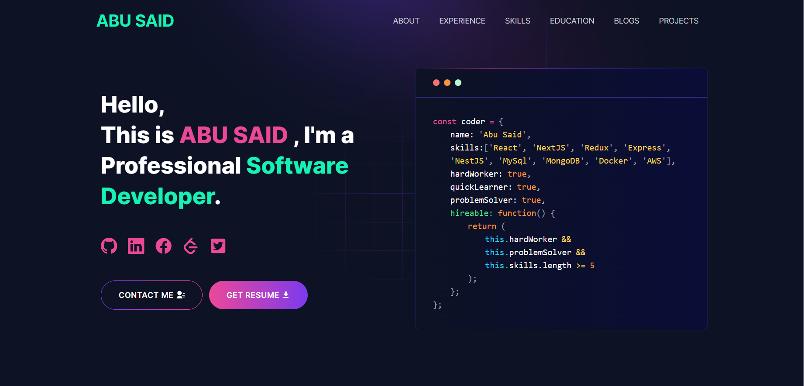

# Van-Loc Nguyen - Developer Portfolio

---

## A professional, responsive, and well-documented portfolio website built with Next.js, TypeScript, and modern development practices.

---

# Demo :movie_camera:



## View live preview [here](https://vanloc1808.github.io/).

---

## Table of Contents :scroll:

- [Sections](#sections-bookmark)
- [Demo](#demo-movie_camera)
- [Installation](#installation-arrow_down)
- [Getting Started](#getting-started-dart)
- [Development Workflow](#development-workflow-hammer_and_wrench)
- [Code Quality & Documentation](#code-quality--documentation-books)
- [Usage](#usage-joystick)
- [Scripts](#scripts-gear)
- [Packages Used](#packages-used-package)
- [Contributing](#contributing-handshake)

---

# Sections :bookmark:

- HERO SECTION
- ABOUT ME
- EXPERIENCES
- SKILLS
- PROJECTS
- EDUCATION
- PUBLICATIONS
- NEWS
- BLOG
- CONTACTS

---

# Installation :arrow_down:

### Prerequisites

You will need to download Git and Node to run this project

- [Git](https://git-scm.com/downloads)
- [Node.js](https://nodejs.org/en/download/) (version 16 or higher)

#### Make sure you have the latest version of both Git and Node on your computer.

```bash
node --version
git --version
```

---

# Getting Started :dart:

### Fork and Clone the repo

To Fork the repo click on the fork button at the top right of the page. Once the repo is forked open your terminal and perform the following commands

```bash
git clone https://github.com/<YOUR GITHUB USERNAME>/vanloc1808.github.io.git

cd vanloc1808.github.io
```

### Install packages from the root directory

```bash
npm install --legacy-peer-deps
# or
yarn install
```

### Environment Setup

Create a new `.env` file from `.env.example` file:

```env
NEXT_PUBLIC_EMAILJS_SERVICE_ID = your_emailjs_service_id
NEXT_PUBLIC_EMAILJS_TEMPLATE_ID = your_emailjs_template_id
NEXT_PUBLIC_EMAILJS_PUBLIC_KEY = your_emailjs_public_key
NEXT_PUBLIC_GTM = your_google_tag_manager_id
NEXT_PUBLIC_APP_URL = "http://127.0.0.1:3000"
NEXT_PUBLIC_RECAPTCHA_SECRET_KEY = your_recaptcha_secret_key
NEXT_PUBLIC_RECAPTCHA_SITE_KEY = your_recaptcha_site_key
```

### Run the development server

```bash
npm run dev
# or
yarn dev
```

Open [http://localhost:3000](http://localhost:3000) with your browser to see the result.

---

# Development Workflow :hammer_and_wrench:

This project follows modern development practices with automated code quality checks and documentation generation.

## Pre-commit Hooks

Git hooks are automatically installed using [Husky](https://typicode.github.io/husky/) to ensure code quality:

- **Linting**: ESLint checks code for potential errors and style issues
- **Formatting**: Prettier automatically formats code for consistency
- **Type Checking**: TypeScript compilation verification

## Code Quality Tools

### ESLint Configuration

- Next.js recommended rules
- TypeScript support
- Prettier integration
- Custom rules for code quality

### Prettier Configuration

- Consistent code formatting
- Tailwind CSS class sorting
- Custom formatting rules

### TypeScript

- Strict type checking
- Modern ES features
- Path aliases for clean imports

---

# Code Quality & Documentation :books:

## Documentation Standards

This project follows strict JSDoc documentation standards:

- All functions, classes, and interfaces must be documented
- Clear descriptions with examples
- Parameter and return type documentation
- Usage examples for complex components

### Documentation Generation

Generate comprehensive API documentation:

```bash
npm run docs:generate
```

This creates HTML and Markdown documentation in the `./docs` directory.

## Code Documentation Guidelines

See [DOCUMENTATION.md](./DOCUMENTATION.md) for detailed documentation standards and examples.

---

# Usage :joystick:

### Email Configuration

1. Go to [emailjs.com](https://www.emailjs.com/) and create a new account
2. Setup your email service and template
3. Add your credentials to the `.env` file

### Customize Your Portfolio

Edit data in the `utils/data` folder to personalize your portfolio:

```javascript
// utils/data/personal-data.ts
export const personalData = {
  name: 'Van-Loc Nguyen',
  profile: '/profile.png',
  designation: 'Full-Stack Software Developer',
  description: 'My name is Van-Loc Nguyen....',
  email: 'vanloc1808@gmail.com',
  phone: '+1234567890',
  address: 'Your Location',
  github: 'https://github.com/vanloc1808',
  linkedIn: 'https://www.linkedin.com/in/vanloc1808/',
  // ... other fields
};
```

### Adding Projects

Add your projects to `utils/data/projects-data.ts`:

```javascript
export const projectsData = [
  {
    id: 1,
    name: 'Project Name',
    description: 'Project description...',
    tools: ['React', 'Node.js', 'MongoDB'],
    role: 'Full Stack Developer',
    code: 'https://github.com/username/project',
    demo: 'https://project-demo.com',
    image: '/path/to/image.jpg',
  },
  // ... more projects
];
```

---

# Scripts :gear:

| Script                  | Description                     |
| ----------------------- | ------------------------------- |
| `npm run dev`           | Start development server        |
| `npm run build`         | Build for production            |
| `npm run start`         | Start production server         |
| `npm run lint`          | Run ESLint                      |
| `npm run lint:fix`      | Fix ESLint issues automatically |
| `npm run format`        | Format code with Prettier       |
| `npm run format:check`  | Check if code is formatted      |
| `npm run type-check`    | TypeScript type checking        |
| `npm run docs:generate` | Generate API documentation      |
| `npm run pre-commit`    | Run all quality checks          |

---

# Packages Used :package:

## Core Dependencies

| Package     | Purpose         |
| ----------- | --------------- |
| next        | React framework |
| react       | UI library      |
| typescript  | Type safety     |
| tailwindcss | CSS framework   |

## UI & Animation

| Package            | Purpose             |
| ------------------ | ------------------- |
| @emailjs/browser   | Email functionality |
| lottie-react       | Animations          |
| react-fast-marquee | Text animations     |
| react-icons        | Icons               |
| react-toastify     | Notifications       |

## Development Tools

| Package     | Purpose                  |
| ----------- | ------------------------ |
| eslint      | Code linting             |
| prettier    | Code formatting          |
| husky       | Git hooks                |
| lint-staged | Pre-commit linting       |
| typedoc     | Documentation generation |

---

# Contributing :handshake:

1. Fork the repository
2. Create a feature branch: `git checkout -b feature/amazing-feature`
3. Make your changes following the documentation standards
4. Run quality checks: `npm run pre-commit`
5. Commit your changes: `git commit -m 'Add amazing feature'`
6. Push to the branch: `git push origin feature/amazing-feature`
7. Open a Pull Request

### Code Style

- Follow the existing code style
- Add JSDoc documentation for all functions and components
- Write descriptive commit messages
- Ensure all tests pass and linting is clean

---

# License :page_facing_up:

This project is licensed under the MIT License - see the [LICENSE](LICENSE) file for details.

---

# Acknowledgements :pray:

- Template originally created by [Abu Said](https://github.com/said7388)
- Enhanced with modern development practices and comprehensive documentation
- Special thanks to the open-source community for the amazing tools and libraries

---

# Contact :mailbox:

Van-Loc Nguyen - [LinkedIn](https://www.linkedin.com/in/vanloc1808/) - vanloc1808@gmail.com

Project Link: [https://github.com/vanloc1808/vanloc1808.github.io](https://github.com/vanloc1808/vanloc1808.github.io)
